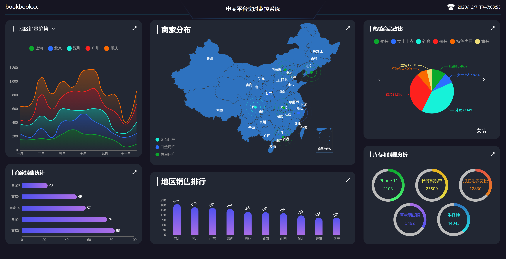
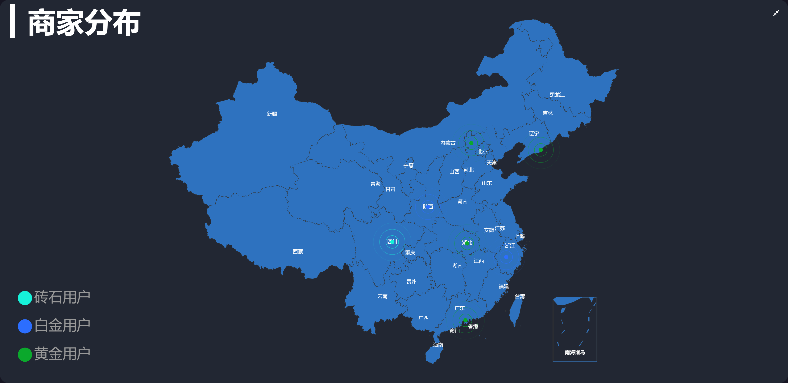
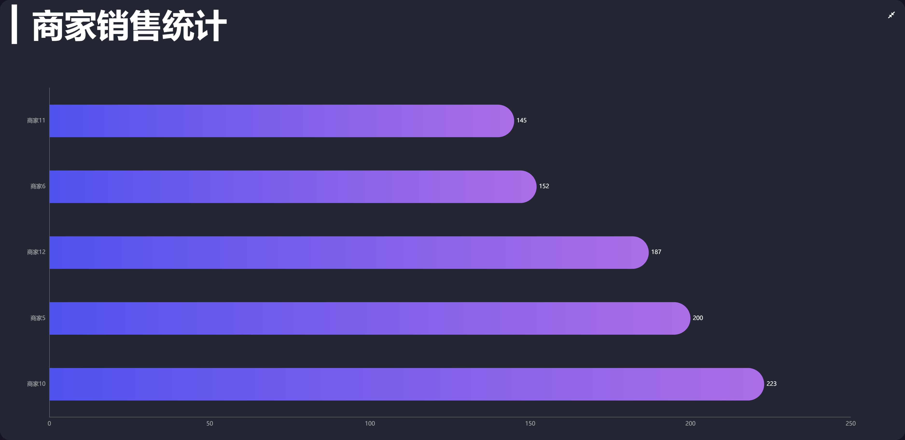
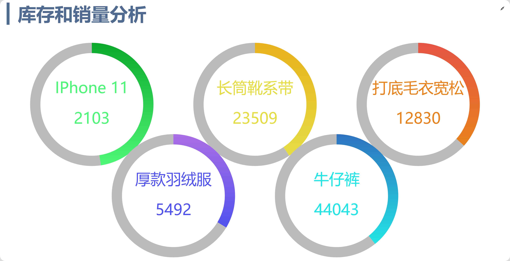

## 电商平台实时监控系统

## 一、技术栈

该项目主要使用 `Vue`搭配`Echarts`采用组件化的方式开发完成,此外项目中陆续使用有
- VueRouter
- VueX
- WebSocket
- axios/fetch
- vue-cli
- ES6
- less 

## 二、运行效果截图

#### 1 黑色主题

#### 2 亮色主题

#### 3 热销商品占比

#### 4 商家分布

#### 5 地区销售排行

#### 6 商家销售统计

#### 7 库存和销量分析

#### 8 地区销量趋势

